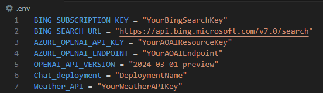

# AOAI-Langchain-Bing

**This repo is an updated version of the AzureGPTwithBingSeach repo, however, now I am using the langchain framework to allow the GPT model to access the model via Bing search API.** 

In this repo I will be using Azure OpenAI GPT-4 Turbo, Langchain, and Bing Search to let Azure GPT get their information from the internet.

* [Bing Web Search API](https://learn.microsoft.com/en-us/bing/search-apis/bing-web-search/overview) used to return webpages related to the query. 
* [Azure OpenAI](https://learn.microsoft.com/en-us/azure/ai-services/openai/overview) used with the page content to provide an answer to the question.
* [Langchain](https://www.langchain.com/) library that is used to create the chatbot agent. 

This repo improves on the last repo by the following: 
1- We only require chat completion model from the Azure OpenAI. (No need for a completion model to extract key-words). 
2- Use BingSearch from the langchain library in order to use it as a tool for the langchain agent. 
3- Using a langchain agent that allows to store the chat history, use various tools, and display the thought process of the AOAI model. 
4- We can return multiple webpages to enrich the AOAI model with information. (This also means that AOAI will process more tokens and occur more cost)


# Table of contents:
- [Step 1 - Getting Things Ready](https://github.com/ABDFMSM/AzureGPTwithBingSeach?tab=readme-ov-file#step-1---getting-things-ready)  
- [Step 2 - Getting a URL from the Bing Web Search API](https://github.com/ABDFMSM/AzureGPTwithBingSeach?tab=readme-ov-file#step-2---getting-a-url-from-the-bing-web-search-api)  
- [Step 3 - Getting the Contents of the Webpage](https://github.com/ABDFMSM/AzureGPTwithBingSeach?tab=readme-ov-file#step-3---getting-the-contents-of-the-webpage)  
- [Step 4 - Using Azure Open AI model to answer the question](https://github.com/ABDFMSM/AzureGPTwithBingSeach?tab=readme-ov-file#step-4---using-azure-open-ai-model-to-answer-the-question)  
- [Output Example](https://github.com/ABDFMSM/AzureGPTwithBingSeach?tab=readme-ov-file#output-example)

# Step 1 - Getting Things Ready:
Before starting anything we would need to install the required python packages.  
You can do that by using the following command: 
```
pip install -r requirements.txt
```
We would need to import the following libraries: 
``` Python
import os
import requests
from bs4 import BeautifulSoup
from dotenv import load_dotenv
from langchain.tools import Tool
from langchain_openai import AzureChatOpenAI
from langchain_core.messages import SystemMessage
from langchain.memory import ConversationBufferWindowMemory
from langchain_community.utilities import BingSearchAPIWrapper
from langchain.agents import AgentExecutor, create_openai_tools_agent
from langchain_core.prompts.chat import ChatPromptTemplate, HumanMessagePromptTemplate, MessagesPlaceholder
```

I have created .env file that will contain the keys and endpoints for the Bing and Azure OpenAI resource.  
On VScode you can create an empty file and you name it .env which should contain the following: 
  

## Configuring AOAI and Bing Seach Resoruce
We will need to get the Key and Endpoint for the AOAI model from the Azure portal as shown below: 
 

We will need to get the Bing Web Search key and store the value in the .env file as shown: 
 

To configure the Bing resource, we load env variables via load_dotenv and we create our bingsearch instance: 
``` Python
load_dotenv()
search = BingSearchAPIWrapper()
```

# Step 2 - Getting Webpage content from BingSearch:
I have created a function that will return Webpages from the Bing search API related to answer the user's question. 
This function will be used as a tool for the langchain agent. 
``` Python
def WebContent(query):
    """
    This tool is used to return the WebPage contents and can be used to answer user's questions. 
    """
    headers = {'user-agent':'Mozilla/5.0 (Windows NT 6.3; Win64; x64) AppleWebKit/537.36 (KHTML, like Gecko) Chrome/86.0.4240.193 Safari/537.36'}
    results = search.results(query, 3) #Number of webpages to check and return content. 
    links = []
    contents = []
    for result in results: 
        #Some pages don't return expected result so we use a try except method to avoid getting an errors. 
        try:
            webpage = requests.get(result['link'], headers)
            soup = BeautifulSoup(webpage.content, 'html.parser')
            text = soup.find('body').get_text().strip()
            cleaned_text = ' '.join(text.split('\n'))
            cleaned_text = ' '.join(text.split())
            contents.append(cleaned_text)
            links.append(result['link'])
        except:
            continue
    return contents, links
```

# Step 3 - Configuring the chatbot agent: 
I used a ChatPromptTemplate that will allow us to configure the system message to instruct the AOAI model. 
Also to make the AOAI aware of the tools via "agent_scratchpad", the chat history and user's questions. 
``` Python
prompt = ChatPromptTemplate.from_messages(
    [
        SystemMessage(
            content="""You are an AI assistance who can access the internet through bing_search tool. 
            The bing_search tool will return the webpage content that contains information that you can use to answer user's question. 
            Whenever asked about time, weather, and date use the bing_search tool and just provide a short answer. 
            For other questions provide a max of one paragraph unless instructed otherwise.
            If you get blocked or access deny, try another query for the bing_search tool to get access to a different website.
            Talk a bit to the user while grabbing the result. 
            Always provide the link in the following format. "\nUsed this link: {link} to answer your question. 
            """
        ),  # The persistent system prompt
        MessagesPlaceholder(
            variable_name="chat_history"
        ),  # Where the memory will be stored.
        MessagesPlaceholder(
            variable_name='agent_scratchpad'
        ),  # where tools are loaded for intermediate steps.
        HumanMessagePromptTemplate.from_template(
            "{input}"
        ),  # Where the human input will injected
    ]
)
```
Here I configure the memory to keep chat history, the tool that would use WebContent function and the AOAI model that would be used by the agent. 
``` Python
memory = ConversationBufferWindowMemory(memory_key="chat_history", return_messages=True, k= 8) #Chat memory window that keeps k messages. 
llm = AzureChatOpenAI(azure_deployment=os.getenv("Chat_deployment"), streaming=True)
tool = Tool(
    name="bing_search",
    description="Search Bing for recent results.",
    func=WebContent
)

# Creating the langchain agent: 
agent = create_openai_tools_agent(llm, [tool], prompt)
agent_executor = AgentExecutor(
    agent=agent,
    tools=[tool],
    verbose=True, #Set to true to view the thought process in the AOAI model.
    memory=memory,
    max_iterations= 8 # Number of tries to retrieve data before exiting agent. 
)
```

# Step 4 - Running the code
Finally we can run the following code to start the conversation with the chatCompletion model, it will always provide the URL that it used to answer user's questions.
The chatbot will continue the conversation until the user type "exit" to end the chat and the chat history will be printed out. 
``` Python
def main():
    question = input("What do you like to ask?\n")
    while "exit" not in question.lower():  
        answer = agent_executor.invoke({"input": question})
        print(answer['output'])  
        question = input("\nDo you have other queries you would like to know about? if not type exit to end the chat.\n")  
    print(memory.load_memory_variables({})) #print the chat history. 

if __name__ == "__main__":
    main()     
```


